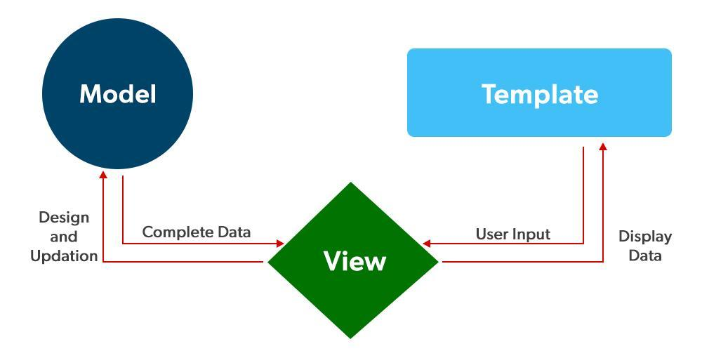
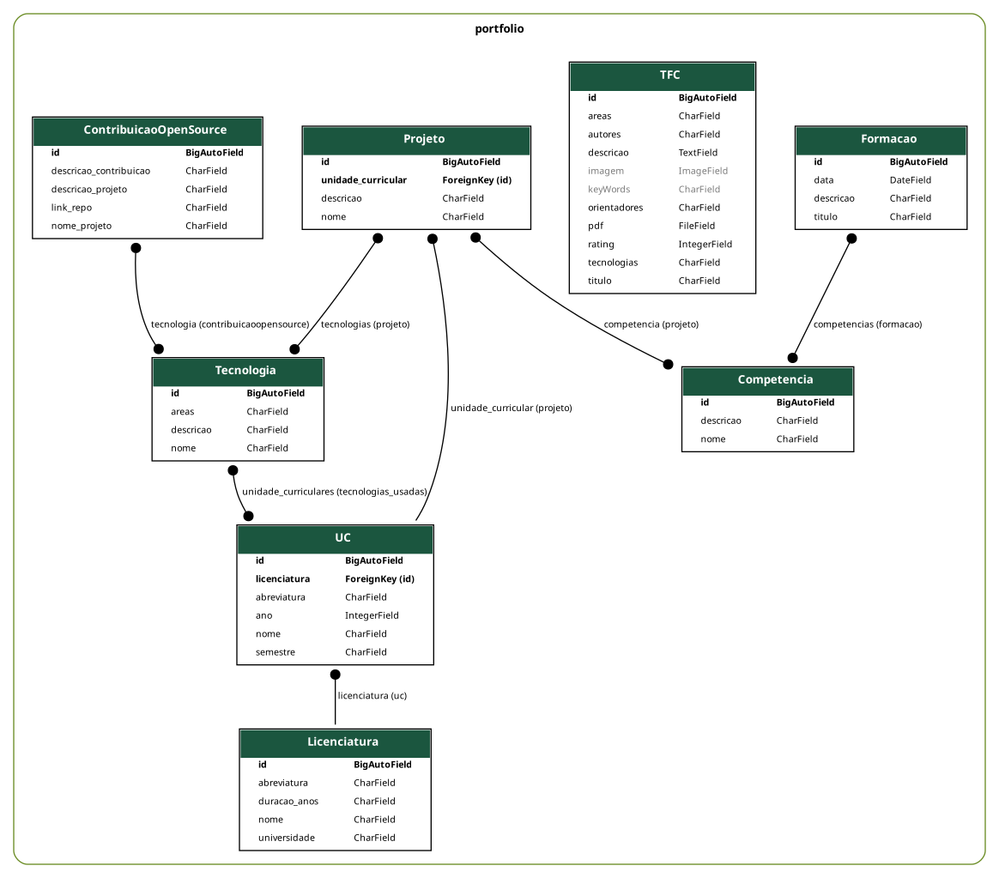

# Arquitetura MVT do Django

A arquitetura MVT é uma arquitetura para o desenvolvimento de websites que define responsabilidades específicas para pedaçoes do código.

A ideia é que o código seja mais organizado, reutilizável e fácil de manter.

## Componentes

### Model

Os modelos representam os dados e lógica de negócio.

- Definem a estrutura das tabelas dentro da base de dados;
- Utiliza o ORM do Django para manipular a base de dados sem precisar escrever SQL diretamente.
- Cada classe corresponde a uma tabela

### View

A view no MVT não são a interface visual (como na famosa arquitetura MVC), em django as views são a lógica que processa pedidos.

1. Recebe request
2. Interagem com Models
3. Decidem que dados enviar para o template
4. Retornam uma response

### Template

O template é a camada visual da aplicação.

1. Recebe os dados das views
2. Renderiza o html + dados para a interface final 

### Fluxo da aplicação

1. Utilizador faz um pedido
2. Django usa o ficheiro `urls.py` para saber qual view deve tratar o request
3. View processa o pedido
   - Recebe o request
   - Consulta o Model
4. Model consulta a base de dados para o pedido da view e retorna o que foi pedido
5. View envia dados ao Template
6. Template gera o html e devolve para o utilizador

# Modelação

# Tecnologias Usadas

- Django
- HTML
- CSS
- Git/GitHub

# Repositório GitHub

Podes conferir o meu repositório no github [aqui](https://github.com/gui-alb/portifolio-pw) 😀